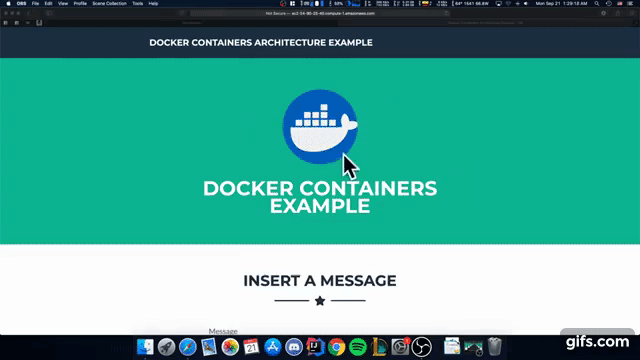

# Custom String Framework Implementation
The project is composed by different Docker containters each one of them belonging to a different layer, those containers have the web client and the load balancer where there requests are made, the web server where those requests are handled adn finally the database where all the information is stored. The project is a small implementation of the following architecture


* To check a demo of the implementation, follow the next [link](https://youtu.be/euR5w0nvFPI)


## Badges
Continous Integration for Web Server [](https://circleci.com/gh/srubianof/arep-webserver)
Continous Integration for Load Balancer [](https://circleci.com/gh/srubianof/arep-loadbalancer)
## Getting Started
The following steps are required in order to get a copy of the project, and be able to run it and perform tests.
### Prerequisites
You need to have installed the next software to successfully run the project:

* Java recommended Java 8
* Maven
* Git
* Docker
### Installing
This a step by step guide that will tell you how to get a copy of the project and how to execute
        
First get a copy of the repository
```
git clone https://github.com/srubianof/AREP-LAB-3.git
```
Once the project is downloaded in your machine, you need to get the Docker images in this case would be the LoadBalancer and the REST service
```
docker pull srubianof/boadbalancer
```
```
docker pull srubianof/primersparkwebrepo
```

## Test execution
 In order to run the test you have to keep in mind that you must have downloaded the repository and have opened a new terminal in the project folder.
 
 To execute the tests you have to type the following command:
 
 ```
mvn test
```
## Program execution
For a proper execution of the project, please perfom it in a UNIX environment where you use the provided shell program to a controlled execution:

```
sh pruebita.sh
```


## Built With
* Java 8
* Docker
* MongoDB
* Git - Version-control system
* [Maven](https://maven.apache.org) - Dependency Management
## Javadoc

The complete documentation of the project can be found [here](https://srubianof.github.io/arep-lab-3-docs/).

The complete report of the activity can be found [here](https://github.com/srubianof/AREP-LAB-3/blob/master/AREP_LAB_3.pdf)


In order to generate the documentation type the following commands in the terminal:
* This generates a html with the javadoc
```
mvn javadoc:javadoc
```

* This generates a site for the project where the project's reports are included.
```
mvn site
```
* This opens the site where the documentation is located
```
mvn site:run
```

## Author

[**Santiago Rubiano Fierro**](https://github.com/srubianof) Software Engineering Student

## License

 This project is licensed under the MIT License - see the [LICENSE.md](https://github.com/srubianof/AREP-LAB-1/blob/master/LICENSE) file for details.
